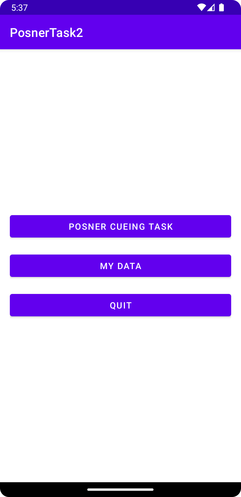
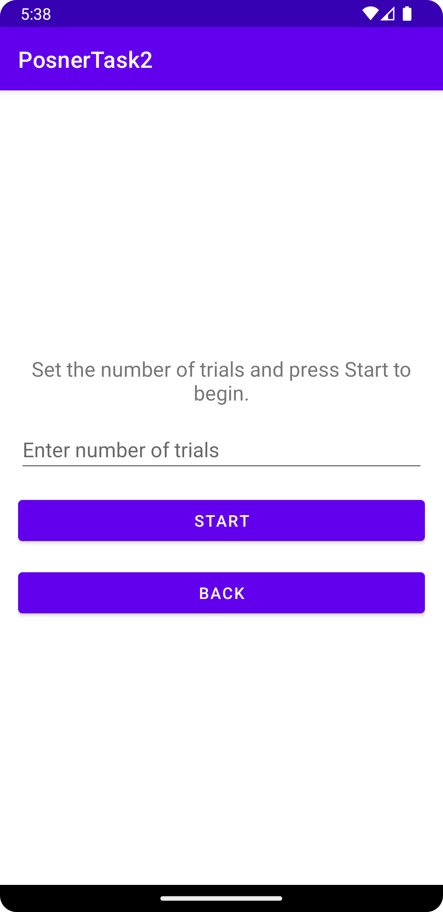
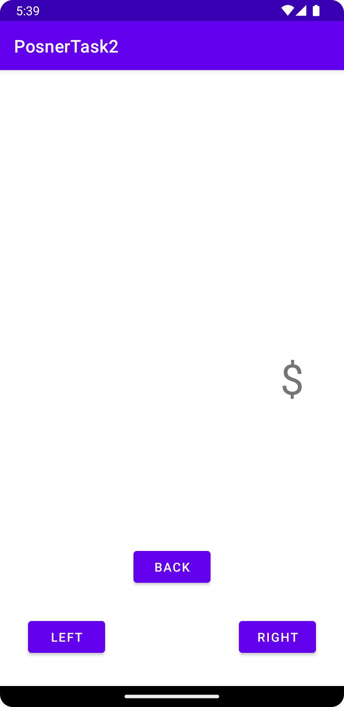
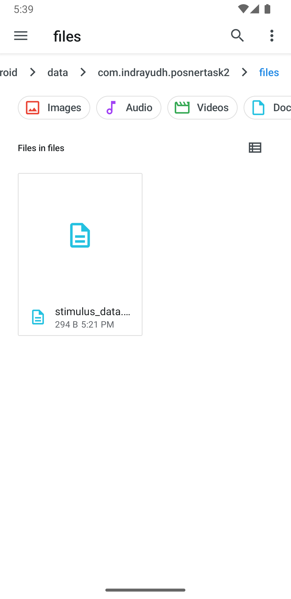
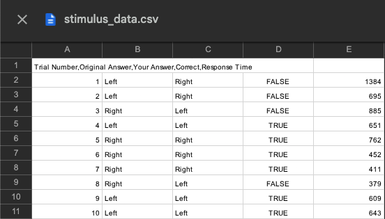

# Posner Cueing Task Android Application

**Posner Cueing Task** is a lightweight and simple Android application designed to conduct and record experiments based on the Posner Cueing Task paradigm. This app enables users to customize the number of trials, collect response times, and export data for further analysis in CSV format.

---

## Features

- **Main Screen**:  
  The home screen provides access to three primary functions:  
  1. **Posner Cueing Task**: Start and customize your experiment.  
  2. **My Data**: View response times recorded during the task.  
  3. **Quit**: Exit the application.  

- **Trial Customization**:  
  Configure the number of trials for the experiment. The default value is set to 10 trials.

- **Data Export**:  
  Collected response times are automatically exported in CSV format to your device's external memory at:  
  `/android/data/stimulusData.csv`

---

## Screenshots

**Main Screen**  

_Description: Main screen with three buttons (Posner Cueing Task, My Data, Quit)._

**Intermediate Screen**  

_Description: Intermediate screen for setting the number of trials._

**Task Screen**  

_Description: Task screen for the main experiment._

**CSV Export**  

_Description: CSV File getting exported to the external memory_


---

## Installation

1. Clone this repository to your local machine:
   ```bash
   git clone https://github.com/yourusername/posner-cueing-task.git

2. Open the project in Android Studio.  
   - Ensure you have all required dependencies installed.  
   - Sync the Gradle files if prompted.

3. Build and run the application on an Android emulator or a physical device.
   - Connect your Android device via USB and enable Developer Mode.  
   - Select the device/emulator in Android Studio and click the **Run** button.
  
## How to Use

1. **Launch the App**: Open the application on your Android device.
2. **Start an Experiment**:
   - Click on **Posner Cueing Task** from the main screen.
   - Set the desired number of trials (default: 10).
   - Begin the experiment and follow the instructions.
3. **View and Export Data**:
   - Access recorded response times through the **My Data** section.
   - The data is automatically saved in CSV format at `/android/data/stimulusData.csv`.

---

## File Format

The exported CSV file contains the following columns:
Sample:  



Contact
For queries or feedback, please contact indrayudhmandal2010@gmail.com

